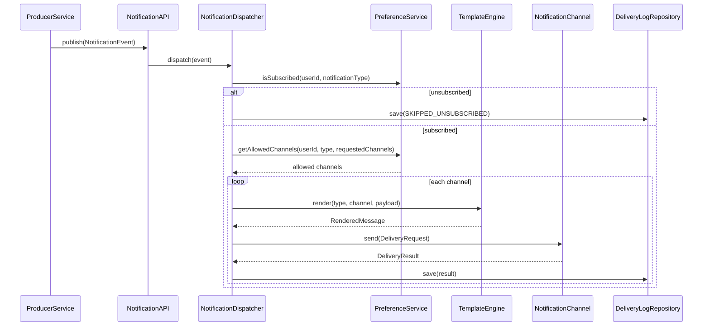

# Notification System LLD (Interview-Ready)

## 1) Problem framing

Design a generic notification system that supports:

- Multiple channels: `EMAIL`, `SMS`, `PUSH`
- User opt-in/out for channels
- User subscription to notification types like `PRODUCT_ALERT`, `ORDER_CONFIRMATION`
- Reuse by multiple producer services

This document is intentionally LLD-focused for interviews and avoids production infrastructure code.

## 2) Scope boundary

- **Inside scope:** domain model, orchestration, interfaces, patterns, flow, and extension points
- **Outside scope:** broker internals, real provider integration code, persistence implementation details
- **Pub-Sub assumption:** producers publish events, notification service consumes them

## 3) Core domain models

```java
enum ChannelType { EMAIL, SMS, PUSH }

enum NotificationType {
    PRODUCT_ALERT,
    ORDER_CONFIRMATION,
    PAYMENT_FAILED,
    DELIVERY_UPDATE
}

enum Priority { LOW, MEDIUM, HIGH }

enum DeliveryStatus { SUCCESS, FAILED, SKIPPED_UNSUBSCRIBED, SKIPPED_CHANNEL_DISABLED }
```

```java
final class NotificationEvent {
    String eventId;
    String sourceService;
    String userId;
    NotificationType notificationType;
    Map<String, Object> payload;
    Set<ChannelType> requestedChannels;   // optional override from producer
    Priority priority;
    Instant createdAt;
}
```

```java
final class UserPreference {
    String userId;
    Set<ChannelType> enabledChannels;
    Set<NotificationType> subscribedTypes; // e.g. PRODUCT_ALERT, ORDER_CONFIRMATION
    Map<NotificationType, Set<ChannelType>> perTypeChannelOverrides; // optional
}
```

```java
final class RenderedMessage {
    String subject;      // optional for non-email
    String title;        // optional for push
    String body;
    Map<String, String> metadata;
}

final class DeliveryRequest {
    String eventId;
    String userId;
    NotificationType type;
    ChannelType channel;
    RenderedMessage message;
    Priority priority;
}

final class DeliveryResult {
    String providerMessageId;
    DeliveryStatus status;
    String errorReason;
    Instant processedAt;
}

final class DeliveryLog {
    String deliveryId;
    String eventId;
    String userId;
    ChannelType channelType;
    DeliveryStatus status;
    String errorReason;
    Instant createdAt;
    Instant updatedAt;
}
```

## 4) Interfaces and responsibilities

### 4.1 Channel strategy (Strategy pattern)

```java
interface NotificationChannel {
    ChannelType channelType();
    DeliveryResult send(DeliveryRequest request);
}

final class EmailChannel implements NotificationChannel { /* provider-specific */ }
final class SmsChannel implements NotificationChannel { /* provider-specific */ }
final class PushChannel implements NotificationChannel { /* provider-specific */ }
```

### 4.2 Factory for channel resolution

```java
interface ChannelStrategyFactory {
    NotificationChannel getChannel(ChannelType channelType);
}
```

### 4.3 Preference and template services

```java
interface PreferenceService {
    boolean isSubscribed(String userId, NotificationType type);
    boolean isChannelEnabled(String userId, ChannelType channelType);
    Set<ChannelType> getAllowedChannels(String userId, NotificationType type, Set<ChannelType> requestedChannels);
}

interface TemplateEngine {
    RenderedMessage render(NotificationType type, ChannelType channelType, Map<String, Object> payload);
}
```

### 4.4 Repositories (Repository pattern)

```java
interface UserPreferenceRepository {
    Optional<UserPreference> findByUserId(String userId);
    void save(UserPreference preference);
}

interface TemplateRepository {
    Optional<String> findTemplate(NotificationType type, ChannelType channelType);
}

interface DeliveryLogRepository {
    void save(DeliveryLog log);
    boolean existsByEventIdAndChannel(String eventId, ChannelType channelType); // idempotency hook
}
```

### 4.5 Orchestration (application service)

```java
interface NotificationDispatcher {
    void dispatch(NotificationEvent event);
}

interface NotificationAPI {
    void publish(NotificationEvent event);
}
```

## 5) Main flow (explicit subscription enforcement)



## 6) Pseudocode for dispatcher

```java
void dispatch(NotificationEvent event) {
    validate(event);

    if (!preferenceService.isSubscribed(event.userId, event.notificationType)) {
        deliveryLogRepository.save(skipLog(event, DeliveryStatus.SKIPPED_UNSUBSCRIBED, "User unsubscribed from type"));
        return;
    }

    Set<ChannelType> channels = preferenceService.getAllowedChannels(
        event.userId, event.notificationType, event.requestedChannels
    );

    for (ChannelType channelType : channels) {
        if (deliveryLogRepository.existsByEventIdAndChannel(event.eventId, channelType)) {
            continue; // idempotency
        }

        try {
            RenderedMessage rendered = templateEngine.render(event.notificationType, channelType, event.payload);
            DeliveryRequest request = mapToRequest(event, channelType, rendered);
            DeliveryResult result = channelStrategyFactory.getChannel(channelType).send(request);
            deliveryLogRepository.save(successOrFailureLog(event, channelType, result));
        } catch (Exception ex) {
            deliveryLogRepository.save(failureLog(event, channelType, ex.getMessage()));
        }
    }
}
```

## 7) Why this design (patterns + SOLID + DRY)

- **Strategy:** each channel has different send logic; avoids branching explosion in dispatcher.
- **Factory:** central channel resolution; dispatcher stays channel-agnostic.
- **Repository:** persistence abstraction, easy to mock in tests.
- **Service layer:** `PreferenceService` centralizes subscription and channel rules.
- **Pub-Sub boundary:** producer services are decoupled from notification internals.

SOLID mapping:

- **S:** dispatcher orchestrates; channel classes send; template engine renders.
- **O:** add `WHATSAPP` by new channel implementation + factory mapping.
- **L:** all channels substitutable through `NotificationChannel`.
- **I:** small focused interfaces instead of fat service contracts.
- **D:** dispatcher depends on abstractions, not concrete providers.

DRY mapping:

- One dispatcher flow for all channels
- One template engine for all render operations
- One preference service for all eligibility logic

## 8) NFRs and edge cases (interview-safe depth)

- **Scalability:** async queue between API and dispatcher workers.
- **Reliability:** retries with exponential backoff; DLQ for poison events.
- **Idempotency:** dedupe on `eventId + channel`.
- **Observability:** status metrics, failure rate per channel/type, latency histogram.
- **Extensibility:** new notification type mostly template/config change.

Edge cases:

- User unsubscribed from type -> skip and log `SKIPPED_UNSUBSCRIBED`.
- Channel disabled for user -> skip that channel only.
- Missing template for `(type, channel)` -> fail that channel and continue others.
- Provider timeout -> retry; after limit, mark failure and move to DLQ (conceptually).
- Partial success (Email pass, Push fail) -> log per-channel outcome.

## 9) Interview narrative (60-minute pacing)

- **0-10 min:** requirements, assumptions, boundaries
- **10-25 min:** entities and interfaces
- **25-40 min:** dispatch sequence and pseudocode
- **40-50 min:** patterns and SOLID/DRY rationale
- **50-60 min:** NFRs, edge cases, extensibility story

## 10) One-liner for interviewer challenge

“I treat pub-sub as system boundary and keep LLD focused on preference-aware dispatch; Strategy + Factory isolates channel behavior while repositories and services keep business rules testable and extensible.”
